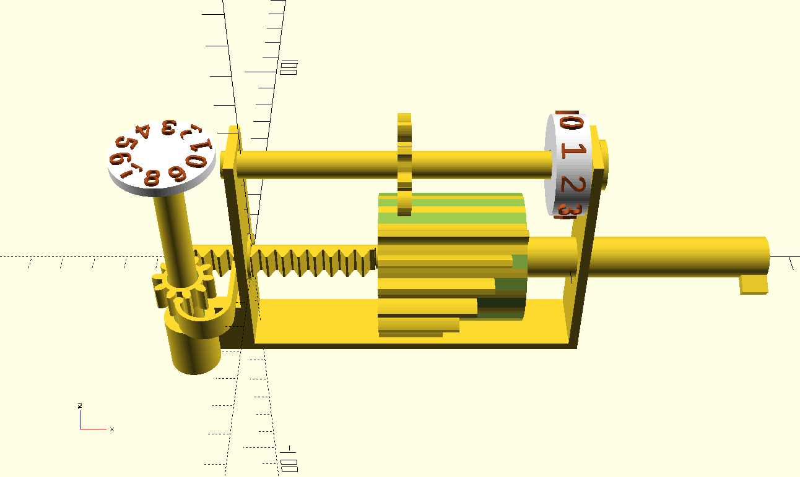
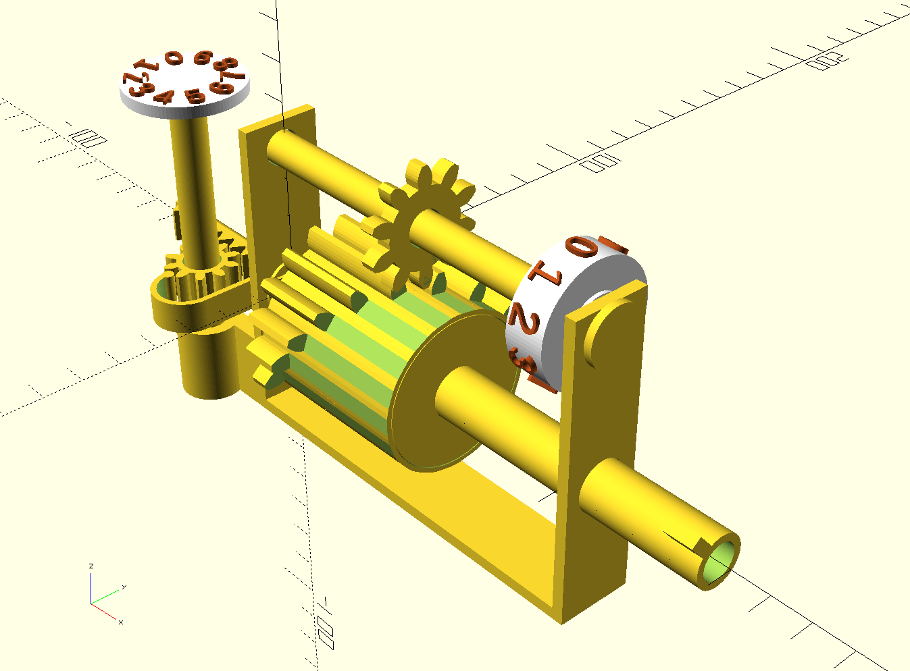
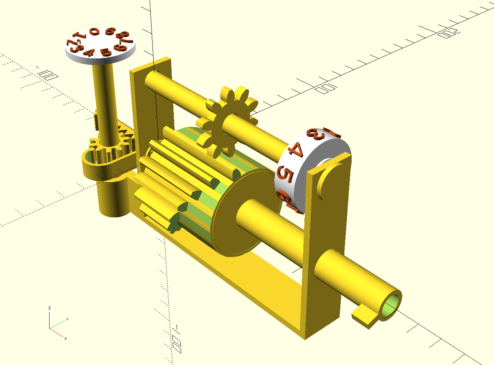
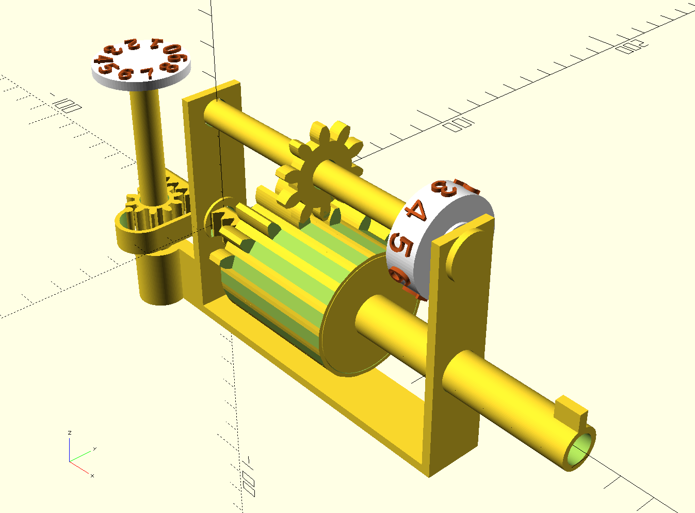
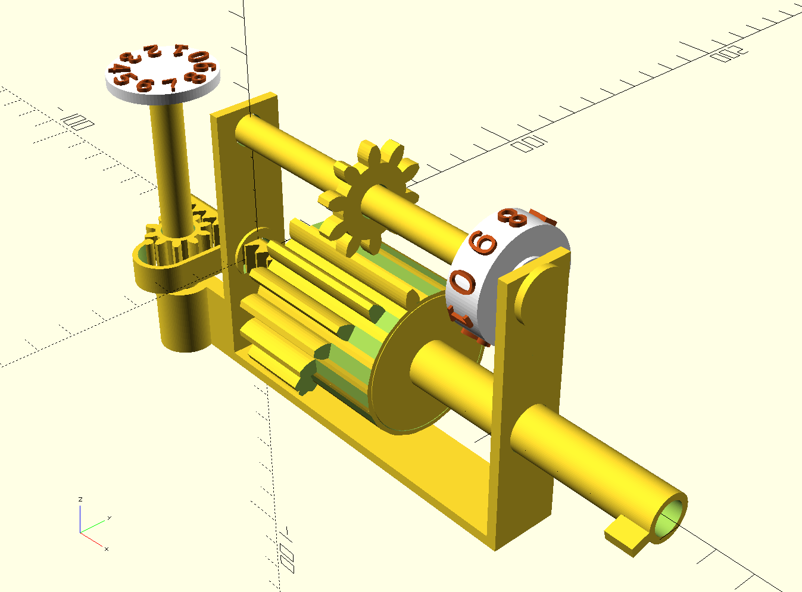

# leibniz-wheel
Leibniz wheel demo 3d model in OpenSCAD

3д-модель одноразрядного сумматора на основе колеса Лейбница.

https://en.wikipedia.org/wiki/Leibniz_wheel

По мотивам макета: https://www.youtube.com/watch?v=H1nz7kMfkMU

Можно распечатать на 3д-принтере (в текущей версии для соединения некоторых деталей потребуется клей).

Использует генератор шестеренок: https://github.com/sadr0b0t/pd-gears

